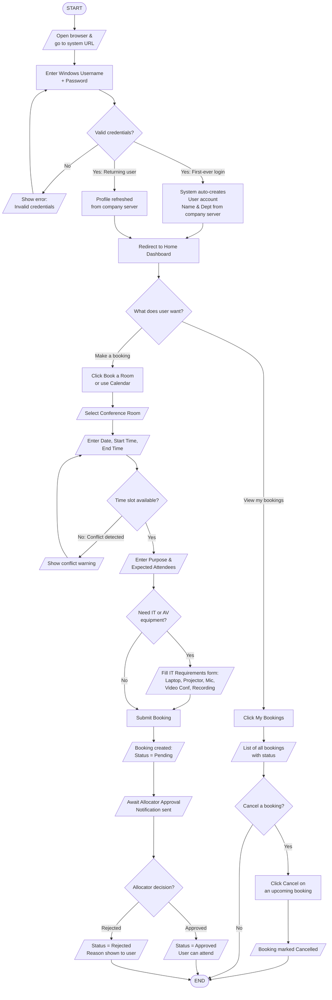
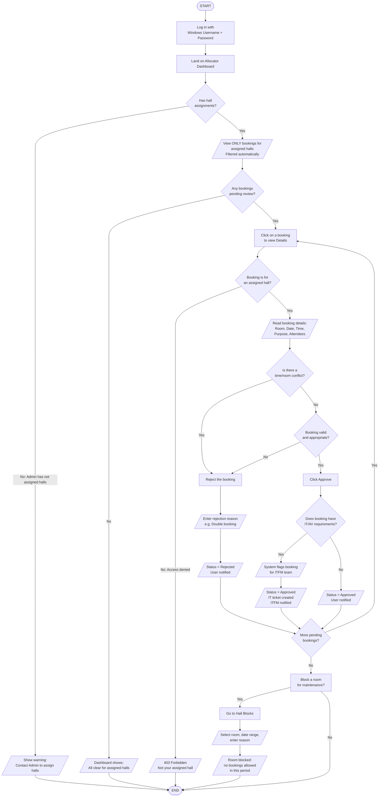
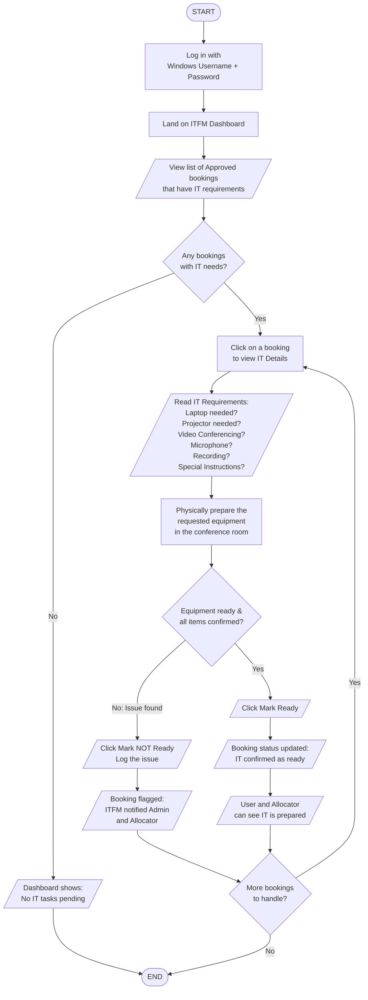
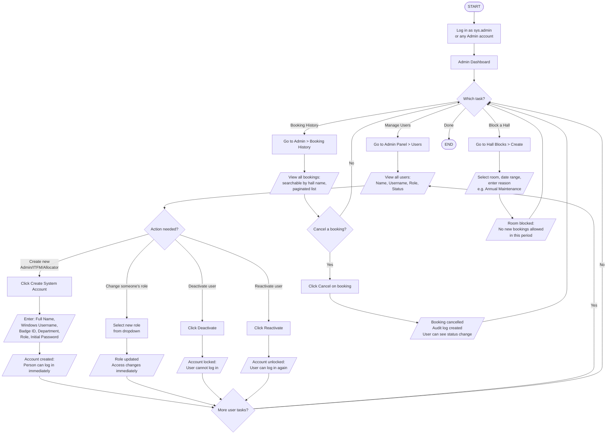
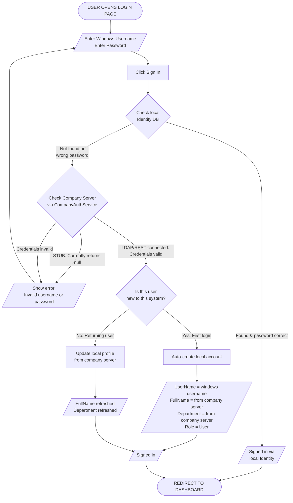

# Role Workflow Flowcharts
## NRL Conference Hall Booking System

> All flowcharts use standard notation:
> **Ovals** = Start / End &nbsp;|&nbsp; **Rectangles** = Process &nbsp;|&nbsp; **Diamonds** = Decision &nbsp;|&nbsp; **Parallelograms** = Input / Output

---

## 1. USER — Booking a Conference Hall

---

## 2. ALLOCATOR — Managing & Approving Bookings (Hall-Specific)

> **Key Rule:** Each Allocator is assigned to specific halls by Admin at account creation.
> They ONLY see bookings for their assigned halls. One hall can have multiple allocators.

---

## 3. ITFM — IT & Facilities Management

---

## 4. ADMIN — Full System Administration

---

## 5. AUTHENTICATION FLOW — How Login Works for All Users

---

*Generated for NRL Conference Hall Booking System*
*All four roles (Admin, Allocator, ITFM, User) plus authentication flow*

