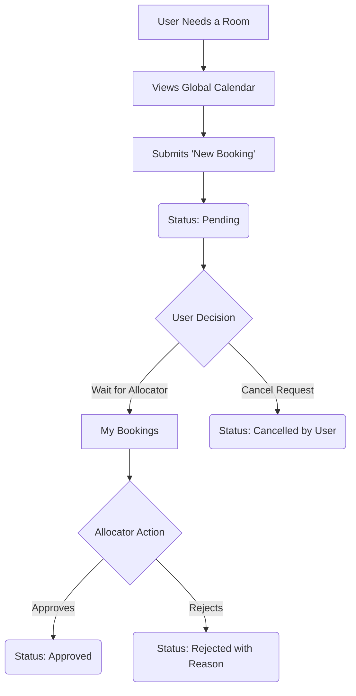
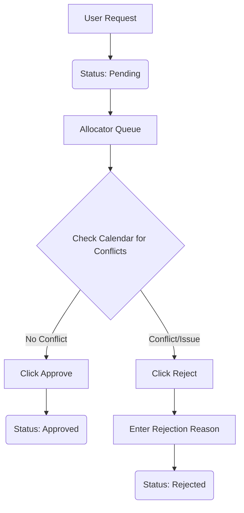
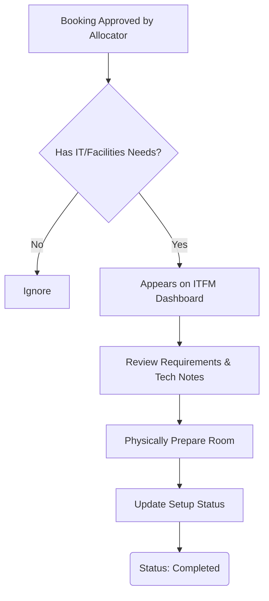
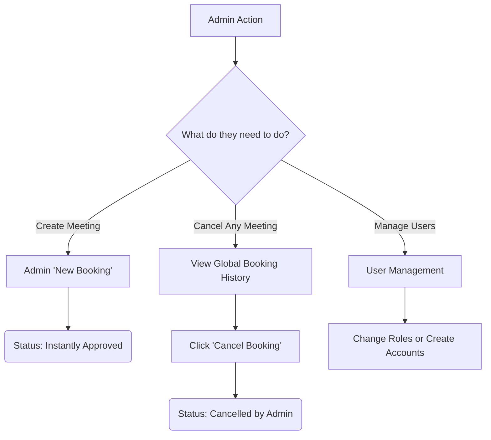

# Refinery Conference Hall Booking System - Role Descriptions

This document outlines the four primary roles in the system, the menu options available to them, and how their specific workflows operate.

---

## 1. STANDARD USER (Employee)
**Role Purpose**: Standard employees who need to book conference rooms for meetings.

### Options & Capabilities:
* **CALENDAR**: Can view the global calendar to see when rooms are booked or available.
* **NEW BOOKING**: Can submit a request for a room. They specify the date, time, attendees, cost centre, and any IT/Catering requirements. The request is submitted in a `Pending` state.
* **MY BOOKINGS**: A personal dashboard showing the history of all their requests. 
  * If a booking is still `Pending`, the user gets a **Cancel** option to withdraw their request.
  * They can see if their booking was Approved, Rejected (with reason), or is still pending.

### Workflow:

---

## 2. ALLOCATOR (Room Manager)
**Role Purpose**: The gatekeeper responsible for managing room schedules and preventing conflicts.

### Options & Capabilities:
* **ALLOCATOR QUEUE (Review)**: A dashboard listing all `Pending` booking requests submitted by users.
* **APPROVE**: The Allocator checks for conflicts. If the slot is clear, they approve it. The booking status changes to `Approved` and the slot is officially locked.
* **REJECT**: If there is a conflict or issue, the Allocator can reject the booking. They are required to type a Rejection Reason, which is immediately visible to the User.
* **EXPORT**: Can export lists of bookings (pending, approved, all) to Excel for reporting.

### Workflow:

---

## 3. ITFM (IT & Facilities Management)
**Role Purpose**: The physical setup team responsible for providing hardware and catering.

### Options & Capabilities:
* **IT & FACILITIES DASHBOARD**: A specialized dashboard that only shows bookings that have already been `Approved` by the Allocator **AND** have specific hardware/catering needs.
* **SETUP STATUS**: They can view the exact requirements (e.g., "Needs 2 Projectors and a PA System"). Once they physically set up the room, they update the Setup Status from `Pending` to `Completed`.
* **HELPDESK / TECH NOTES**: They can add internal technical notes to a booking. They also handle bookings where a user explicitly flagged "Requires ITFM Help".

### Workflow:

---

## 4. ADMIN (System Administrator)
**Role Purpose**: The overarching system administrator with full control over users and bookings.

### Options & Capabilities:
* **USER MANAGEMENT -> ALL USERS**: Can view every registered user in the system. They can change a user's role (e.g., promote a User to an Allocator), and Deactivate/Reactivate accounts if someone leaves the company.
* **USER MANAGEMENT -> CREATE USER**: Can bypass normal registration and manually create a user account, assigning their department and role directly.
* **BOOKINGS -> NEW BOOKING**: When an Admin creates a booking, it completely bypasses the Allocator. It is instantly `Approved` and locked into the calendar.
* **BOOKINGS -> BOOKING HISTORY**: A global, system-wide log of every booking ever made.
  * > [!TIP]
    > **Priority Sorting**: This page prioritizes `Pending` requests at the very top so the Admin can step in if an Allocator is slow.
  * > [!IMPORTANT]
    > **Admin Override**: Includes a powerful **Cancel Booking** button. Admins can cancel ANY meeting at any time (even approved ones) as long as the meeting hasn't ended. This logs explicitly as "Cancelled by Admin".
* **OMNIPOTENCE**: Admins inherit the permissions of Allocators and ITFM, meaning they can view dashboards, approve/reject rooms, and manage IT setups if the standard personnel are unavailable.

### Workflow (Admin Overrides):

